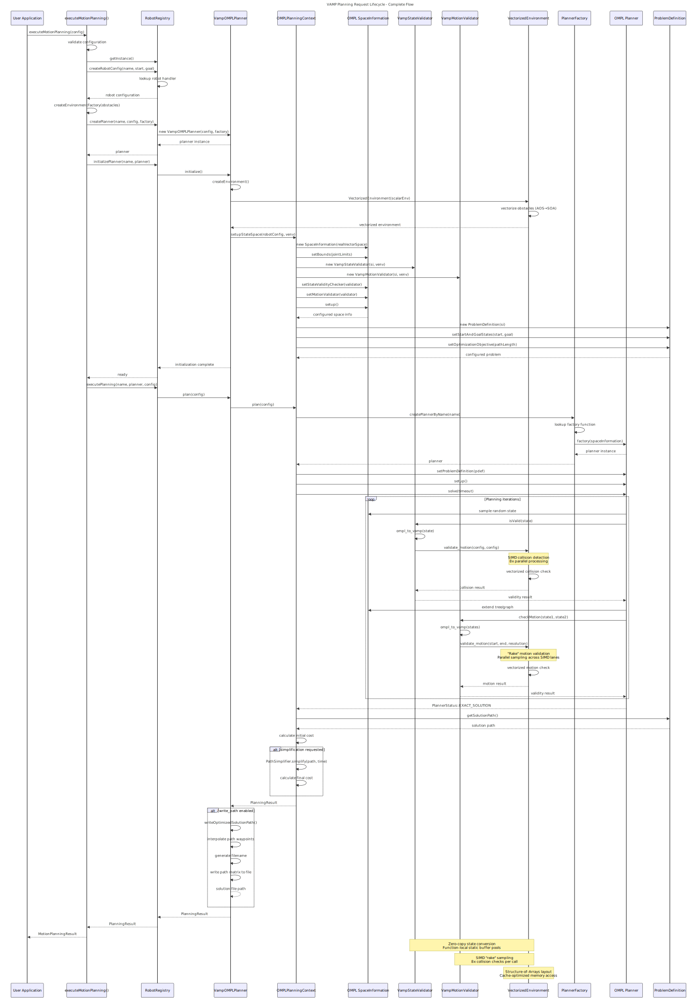

# VAMP Architecture Diagrams

This directory contains comprehensive architecture diagrams for the VAMP (Vectorized Accelerated Motion Planner) system. These diagrams provide visual documentation of the system's design patterns, component relationships, and performance characteristics.

## Diagram Overview

### 1. System Architecture Overview 


**Purpose:** Complete system view showing all layers and components  
**Audience:** System architects, new contributors, project managers  
**Key Elements:**
- User interface layer (YAML/API)
- Unified interface layer (Registry-based execution)
- Planning facade layer (Main coordination components)
- OMPL integration layer (Standard planning interfaces)
- VAMP performance core (SIMD collision detection)
- Robot type system (Built-in and custom robots)
- Benchmarking system (OMPL-compliant infrastructure)
- Extension points (Robot, planner, environment extensions)

**Design Patterns Highlighted:** Facade, Adapter, Registry, Factory, Strategy

### 2. Class Architecture & Design Patterns 


**Purpose:** Detailed class relationships with UML-style documentation  
**Audience:** Software developers, code reviewers, maintainers  
**Key Elements:**
- OMPL foundation interfaces (StateValidityChecker, MotionValidator, Planner)
- VAMP core integration classes (Validators, Planners, Context)
- Configuration system hierarchy (RobotConfig, EnvironmentFactory)
- Registry system (Singleton pattern with type erasure)
- Factory system (Runtime planner creation)
- Template relationships and inheritance hierarchies

**Design Patterns Highlighted:** Template Method, Singleton, Factory Method, Adapter, Registry

### 3. Planning Request Sequence 


**Purpose:** Complete lifecycle from user request to results  
**Audience:** Developers, debuggers, performance analysts  
**Key Elements:**
- Configuration phase (Validation, registry lookup, planner creation)
- Initialization phase (Environment setup, OMPL configuration, validator setup)
- Planning execution (Planner creation, main planning loop, solution processing)
- SIMD collision detection workflow
- Error handling and resource management
- Performance-critical paths

**Flow Highlights:** Two-phase initialization, SIMD vectorization, zero-copy conversions

### 4. SIMD Performance Architecture 


**Purpose:** Memory layout optimization and vectorization strategies  
**Audience:** Performance engineers, optimization specialists, researchers  
**Key Elements:**
- Traditional vs VAMP collision detection comparison
- Memory layout transformation (AOS → SOA)
- "Rake" motion validation strategy
- Vectorized forward kinematics + collision checking
- Performance optimizations and characteristics
- Robot-specific SIMD parameters

**Performance Highlights:** 8x collision speedup, cache optimization, zero-allocation hot paths

## Viewing the Diagrams

The diagrams are available in both Mermaid source format (`.mmd`) and pre-rendered SVG format (`.svg`). The SVG files are ready to view directly and are embedded above in each section.

### regenerating SVGs
```bash
# Install Mermaid CLI
npm install -g @mermaid-js/mermaid-cli

# Generate SVG 
python3 generate_diagrams.py
```
## Integration with Documentation

### In ARCHITECTURE.md
```markdown
**Architecture Overview Diagram**: 
```

### In README.md
```markdown
## System Overview
For a complete system overview, see our [architecture diagrams](docs/diagrams/).
```

### In Code Comments
```cpp
/**
 * @brief Planning request workflow - see docs/diagrams/03-planning-request-sequence.svg
 */
```

## Maintenance Guidelines

### Updating Diagrams
1. **Code changes**: Update diagrams when architectural changes occur
2. **New components**: Add to appropriate diagrams with consistent styling
3. **Performance changes**: Update performance changes in SIMD diagram
4. **Design patterns**: Document new patterns in class architecture diagram

### Consistency Standards
- **Naming**: Use same component names as in code
- **Colors**: Maintain color scheme across diagrams
- **Style**: Follow Mermaid best practices for readability
- **Documentation**: Update this README when adding new diagrams

### Review Process
- Include diagram updates in architectural change reviews
- Validate diagrams render correctly across platforms
- Ensure alignment between code and visual documentation

## Diagram Dependencies

### Internal Dependencies
- Accurate representation of actual code structure
- Consistency with ADRs (Architecture Decision Records)
- Alignment with API documentation
- Synchronization with contributor guidelines

## Performance Considerations

### Optimization Tips
- Break very large diagrams into focused sub-diagrams
- Use consistent node sizing to improve layout
- Minimize crossing lines for better readability
- Use subgraphs to organize related components

## Contributing

### Adding New Diagrams
1. Create `.mmd` file with descriptive name
2. Follow existing naming convention (`NN-description.mmd`)
3. Generate corresponding `.svg` file using regenerating SVGs.
4. Update this README with diagram description and SVG embedding
5. Test rendering across platforms
6. Include in relevant documentation

### Modifying Existing Diagrams
1. Maintain backward compatibility where possible
2. Update documentation if diagram purpose changes
3. Preserve color schemes and styling conventions

### Best Practices
- Start with rough sketch before creating Mermaid code
- Use comments in Mermaid code for complex sections
- Validate syntax before committing
- Consider accessibility (colorblind-friendly colors)
- Include meaningful alt-text for generated images

## Troubleshooting

### Common Issues
- **Rendering errors**: Check Mermaid syntax validity
- **Layout problems**: Adjust node positioning and subgraph organization
- **Performance issues**: Simplify complex diagrams or split into multiple diagrams
- **Platform differences**: Test across different Mermaid renderers

### Debug Process
1. Validate syntax using Mermaid Live Editor
2. Check for unsupported features in target renderer
3. Simplify diagram to isolate problematic elements
4. Consult Mermaid documentation for feature support

## References

- [Mermaid Documentation](https://mermaid-js.github.io/mermaid/)
- [Mermaid Live Editor](https://mermaid.live/)
- [UML Diagram Guidelines](https://www.uml-diagrams.org/)
- [C4 Model Documentation](https://c4model.com/)

---

*For questions about these diagrams or suggestions for improvements, please open an issue or contribute to the documentation.*
